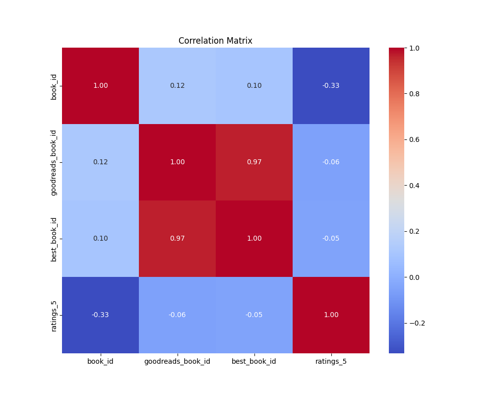
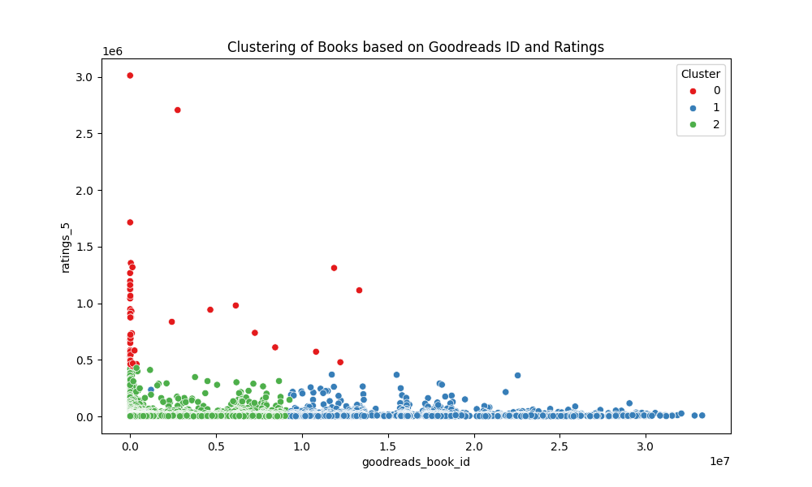

# Books Dataset Analysis Report

## 1. Dataset Overview

The analysis is performed on a dataset representing various attributes of books, including identifiers, ratings, and associated images. The key columns relevant for this analysis are:

- **book_id**: Unique identifier for each book.
- **goodreads_book_id**: Unique ID for the book on Goodreads.
- **best_book_id**: ID of the book considered the best on Goodreads.
- **ratings_5**: Count of 5-star ratings for the book.

## 2. Summary Statistics

We conducted a thorough examination of the dataset and computed the following summary statistics:

- **Mean**:
  - **book_id**: 5000.5
  - **goodreads_book_id**: 5264696.51
  - **best_book_id**: 5471213.58
  - **ratings_5**: 23789.81

- **Median**:
  - **book_id**: 5000.5
  - **goodreads_book_id**: 394965.5
  - **best_book_id**: 425123.5
  - **ratings_5**: 8836.0

- **Mode**:
  - **book_id**: 1.0
  - **goodreads_book_id**: 1.0
  - **best_book_id**: 1.0
  - **ratings_5**: 4541.0

- **Standard Deviation**:
  - **book_id**: 2886.90
  - **goodreads_book_id**: 7575461.86
  - **best_book_id**: 7827329.89
  - **ratings_5**: 79768.89

- **Range**:
  - **book_id**: 10000
  - **goodreads_book_id**: 33288638
  - **best_book_id**: 35534230
  - **ratings_5**: 3011543

## 3. Missing Values

The analysis revealed the following missing values across various columns:
- **isbn**: 700 missing entries
- **isbn13**: 585 missing entries
- **original_publication_year**: 21 missing entries
- **original_title**: 585 missing entries
- **language_code**: 1084 missing entries

All other relevant columns, including `book_id`, `goodreads_book_id`, `best_book_id`, and `ratings_5`, had no missing values.

## 4. Outlier Detection

Using the Interquartile Range (IQR) method, we identified **1158 outliers** in the `ratings_5` column, indicating a significant range in the number of ratings received by various books.

## 5. Correlation Matrix

The correlation analysis generated the following correlation matrix:

|                              | book_id | goodreads_book_id | best_book_id | ratings_5 |
|------------------------------|---------|--------------------|---------------|------------|
| book_id                      | 1.0     | 0.115              | 0.105         | -0.332     |
| goodreads_book_id            | 0.115   | 1.0                | 0.967         | -0.056     |
| best_book_id                 | 0.105   | 0.967              | 1.0           | -0.050     |
| ratings_5                    | -0.332  | -0.056            | -0.050        | 1.0        |

This demonstrates a moderate positive correlation between `goodreads_book_id` and `best_book_id`, while `ratings_5` has a negative correlation with `book_id`.

### Correlation Matrix Plot


## 6. Clustering Analysis

We performed K-means clustering on the dataset to identify potential groupings based on `goodreads_book_id` and `ratings_5`. The clustering analysis generated three distinct groups.

### Clustering Plot


## 7. Conclusion

The comprehensive analysis of the books dataset reveals key insights into the distribution of ratings, the presence of outliers, and relationships within the data. The correlation and clustering analyses provide a basis for further recommendations and decisions regarding book categorization and user experience enhancements on platforms like Goodreads.

```
