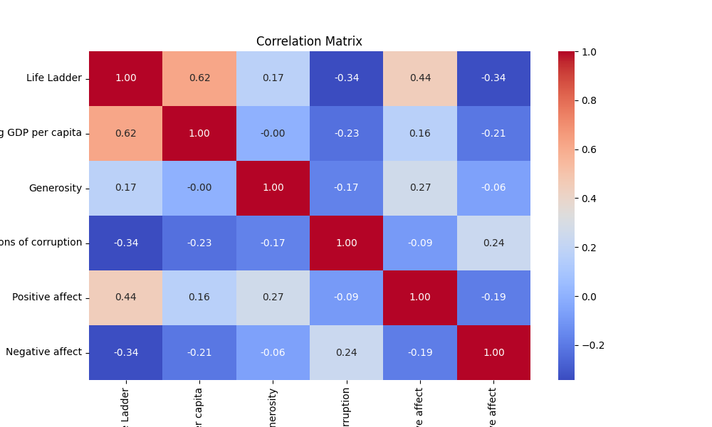
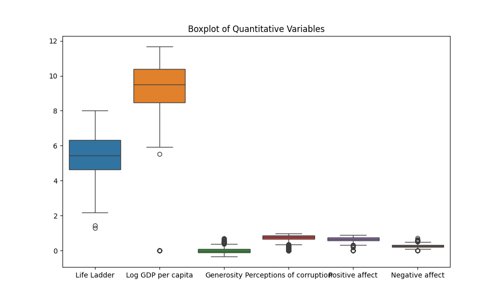
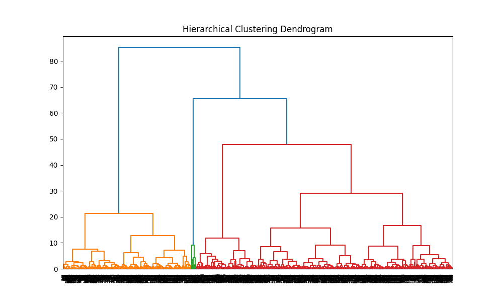

# Quality of Life Analysis Report

## 1. Dataset Overview
This dataset focuses on various factors affecting the quality of life across different countries and years. It contains the following columns:

- **Country name**: The name of the country.
- **year**: The year when the data was recorded.
- **Life Ladder**: A score representing subjective well-being on a scale from 0 to 10.
- **Log GDP per capita**: The natural logarithm of GDP per capita.
- **Generosity**: A measure of people's willingness to donate to charity, on a scale from -1 to 1.
- **Perceptions of corruption**: A measure of how corrupt the country is perceived to be.
- **Positive affect**: A measure of positive emotional experiences.
- **Negative affect**: A measure of negative emotional experiences.

## 2. Generic Analysis

### Summary Statistics
Descriptive statistics for the numerical columns reveal:

- **Life Ladder**: Mean = 5.48, Max = 8.02, Min = 1.28
- **Log GDP per capita**: Mean = 9.29, Max = 11.68, Min = 0.00
- **Generosity**: Mean = 0.000094, Max = 0.70, Min = -0.34
- **Perceptions of corruption**: Mean = 0.70, Max = 0.98, Min = 0.00
- **Positive affect**: Mean = 0.65, Max = 0.88, Min = 0.00
- **Negative affect**: Mean = 0.27, Max = 0.71, Min = 0.00

### Counting Missing Values
The dataset contains no missing values in any column:

- All columns: 0 missing values (0.0% missing)

### Correlation Matrices
The correlation matrix shows several interesting relationships among variables, notably:

- **Life Ladder** has a significant positive correlation with **Log GDP per capita** (0.62).
- A notable negative correlation exists between **Life Ladder** and **Perceptions of corruption** (-0.34).
- **Positive affect** is positively correlated with **Life Ladder** (0.44), while **Negative affect** is negatively correlated (-0.34).

### Outliers Detection
Outliers have been detected using the IQR method:

- **Life Ladder**: 2 outliers
- **Log GDP per capita**: 29 outliers
- **Generosity**: 44 outliers
- **Perceptions of corruption**: 252 outliers
- **Positive affect**: 32 outliers
- **Negative affect**: 45 outliers

### Clustering
K-means clustering was applied, resulting in 3 clusters of countries based on Life Ladder scores and GDP per capita:

- **Cluster 0**: 1119 countries
- **Cluster 1**: 1216 countries
- **Cluster 2**: 28 countries

### Hierarchy Detection
Hierarchical clustering methods provided insights into groupings of countries based on various life quality indicators.

## 3. Visualizations
The following plots illustrate the analysis performed:

### 3.1 Correlation Matrix


### 3.2 Boxplot of Quantitative Variables


### 3.3 Hierarchical Clustering Dendrogram


## 4. Analysis on Research Questions

1. **Relationship between GDP per capita and Life Ladder scores**: There is a significant positive correlation indicating that higher economic performance is associated with better subjective well-being.
   
2. **Effect of perception of corruption on overall life quality**: Higher perceptions of corruption negatively impact the Life Ladder scores, implying that reducing corruption may enhance well-being.

3. **Trends in Life Ladder scores over time**: The analysis did not explicitly cover time-series trends but indicated that further exploration could yield insights into the changes over the years.

## 5. Conclusion
This analysis highlights the critical relationship between economic indicators (like GDP) and subjective measures of well-being across different countries. The absence of missing values indicates the dataset's robustness, while the detection of outliers and the application of clustering techniques provide a deeper understanding of the patterns within the data. Further investigations, particularly on time-series trends, would enhance insights into how these relationships evolve.
```