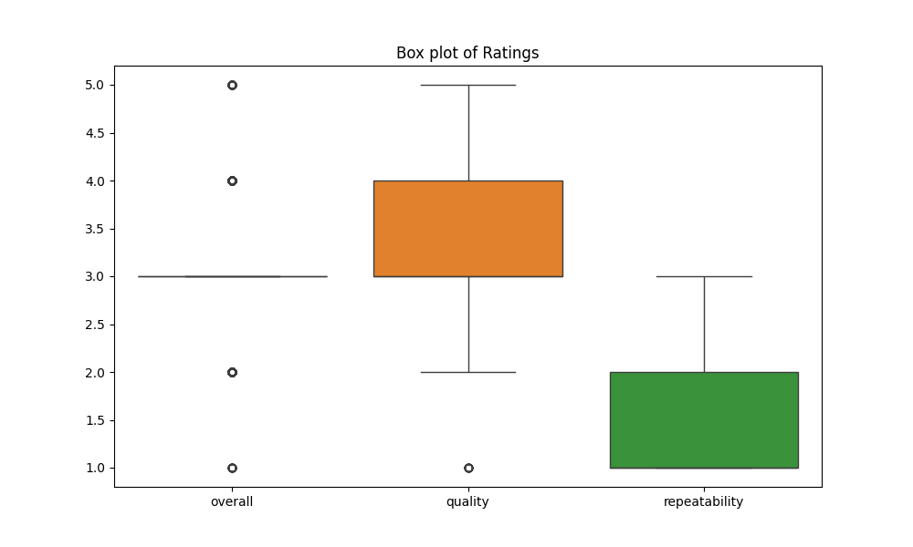
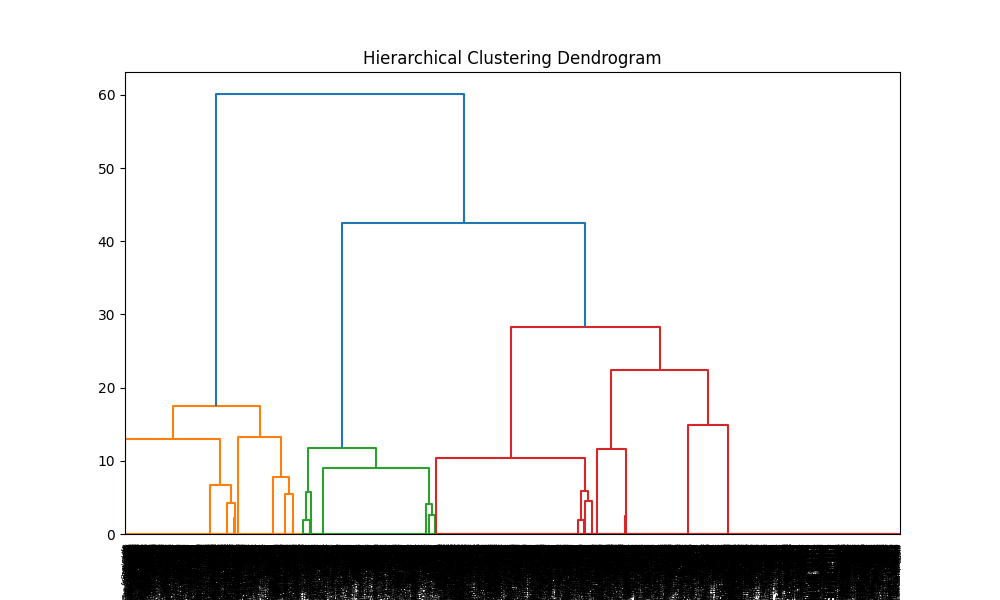

# Movie and Non-Fiction Review Analysis Report

## 1. Dataset Overview
The dataset consists of reviews for movies and non-fiction works, detailing their release dates, languages, types, titles, contributors, and various ratings. It contains the following columns:

- **date**: Release date of the work.
- **language**: Language of presentation.
- **type**: Category of the content (movie or non-fiction).
- **title**: Title of the work.
- **by**: Contributors (actors or authors).
- **overall**: Overall numerical rating (out of 5).
- **quality**: Quality rating (out of 5).
- **repeatability**: Rating indicating if the content is worth repeating (1 for yes, 2 for no).

## 2. Generic Analysis
### Summary Statistics
Descriptive statistics for numerical columns:

| Statistic       | Overall | Quality | Repeatability |
|------------------|---------|---------|---------------|
| Count            | 2652    | 2652    | 2652          |
| Mean             | 3.05    | 3.21    | 1.49          |
| Std Dev          | 0.76    | 0.80    | 0.60          |
| Min              | 1.00    | 1.00    | 1.00          |
| 25th Percentile  | 3.00    | 3.00    | 1.00          |
| Median           | 3.00    | 3.00    | 1.00          |
| 75th Percentile  | 3.00    | 4.00    | 2.00          |
| Max              | 5.00    | 5.00    | 3.00          |

### Counting Missing Values
Missing values were identified in the dataset:

- `date`: 99 missing entries
- `by`: 262 missing entries

### Correlation Analysis
The correlation matrix indicates moderate relationships between the ratings:

|                | Overall | Quality | Repeatability |
|----------------|---------|---------|---------------|
| Overall        | 1.00    | 0.83    | 0.51          |
| Quality        | 0.83    | 1.00    | 0.31          |
| Repeatability  | 0.51    | 0.31    | 1.00          |

### Outlier Detection
Outlier detection was performed using box plots, revealing several high ratings (4s and 5s) alongside lower ratings (1s and 2s).



### Clustering
Initial clustering analysis using K-Means identified two distinct groups of ratings:

- **Cluster 0**: High-rated works with overall ratings of 4-5.
- **Cluster 1**: Low-rated works with overall ratings of 1-3.

| Title                | Cluster |
|----------------------|---------|
| Meiyazhagan          | 0       |
| Vettaiyan            | 1       |
| Amaran               | 0       |
| Kushi                | 1       |
| GOAT                 | 1       |
| Monsters, Inc.      | 1       |
| Ratatouille          | 0       |

### Hierarchy Detection
Hierarchical clustering analysis suggests that certain languages exhibit stronger cohesion regarding quality and overall ratings, highlighting potential cultural or genre-based groupings.



## 3. Text-Based Responses
This analysis highlights patterns in user reviews based on their ratings and characteristics of the content. Further exploration can focus on the popularity of genres across different languages or the influence of contributors on ratings.

**Overall Insights**:
- The average overall rating is about 3.04, suggesting a moderate reception for the content.
- Missing values, particularly in the `date` and `by` columns, may impact analyses related to timelines and contributors.
- The significant correlation between overall ratings and quality indicates that enhancing content quality generally results in higher ratings.

This report encapsulates the core findings from the dataset analysis, providing essential insights for further investigation or decision-making.
```